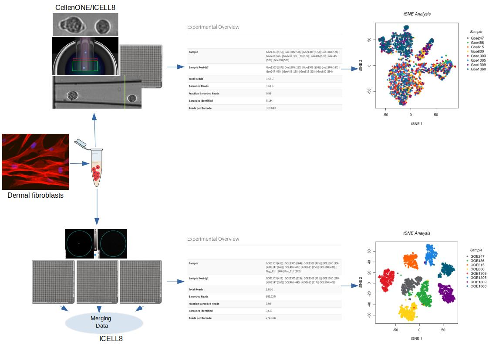

# Utilising CogentDS to analyse data from novel single-cell approach
This repository contains R scripts used to analyse single-cell RNA-seq data generated by a novel approach combining the [CellenONE&reg; X1 instrument from CELLENION](https://www.cellenion.com/products/cellenone-x1/) utilising Image Based Single Cell Isolation (IBSCIT&trade;) to isolate and sort cells with the [ICELL8&reg; cx Single-Cell System from Takara](https://www.takarabio.com/products/automation-systems/icell8-system-and-software/icell8-cx-single-cell-system) to process the cells for sequencing.

# Citation
The scripts were used to generate the figures and results for the following paper:
> **Novel single-cell RNA-sequencing platform and its applicability connecting genotype to phenotype in ageing-disease.**   _Orr Shomroni, Maren Sitte, Julia Schmidt, Sabnam Parbin, Fabian Ludewig, Gökhan Yigit, Laura Cecilia Zelarayan, Katrin Streckfuss-Bömeke, Bernd Wollnik, Gabriela Salinas_  
> bioRxiv 2021.10.25.465702  
> doi: https://doi.org/10.1101/2021.10.25.465702  
