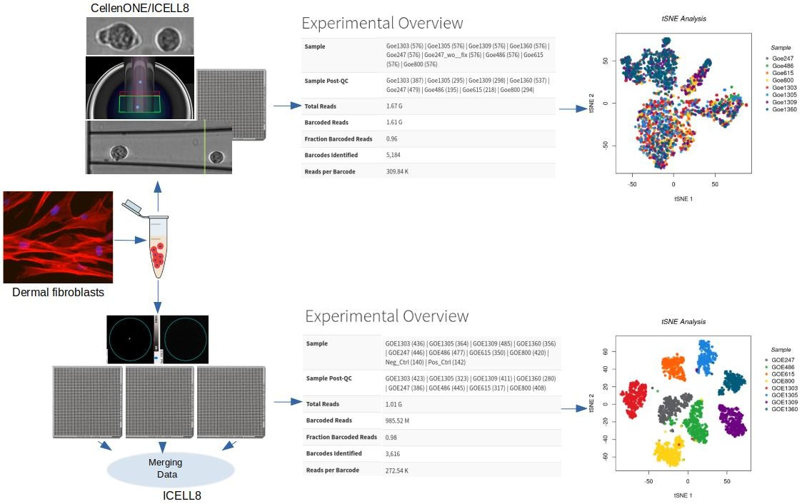

# Utilising Cogent Analysis Pipeline (CogentAP) and Discovery Software (CogentDS) to analyse data from novel single-cell approach
This repository contains shell and R scripts used to analyse single-cell RNA-seq data generated by a novel approach combining the [CellenONE&reg; X1 instrument from CELLENION](https://www.cellenion.com/products/cellenone-x1/) utilising Image Based Single Cell Isolation (IBSCIT&trade;) to isolate and sort cells with the [ICELL8&reg; cx Single-Cell System from Takara](https://www.takarabio.com/products/automation-systems/icell8-system-and-software/icell8-cx-single-cell-system) to process the cells for sequencing.



## Requirements
### Genome assembly references
- [ENSEMBL _Homo Sapiens_ hg38 FASTA file](http://ftp.ensembl.org/pub/release-105/fasta/homo_sapiens/dna/Homo_sapiens.GRCh38.dna.primary_assembly.fa.gz)
- [ENSEMBL _Homo Sapiens_ GTF annotation v103](http://ftp.ensembl.org/pub/release-103/gtf/homo_sapiens/Homo_sapiens.GRCh38.103.gtf.gz)
### Software
- [Cogent NGS Analysis Pipeline v1.0](https://www.takarabio.com/products/automation-systems/icell8-system-and-software/bioinformatics-tools/cogent-ngs-analysis-pipeline)
- [cutadapt v2.5](https://cutadapt.readthedocs.io/en/stable/)
- [STAR v2.7.2b](https://github.com/alexdobin/STAR)
- [samtools v1.1](https://www.htslib.org/)
- [featureCounts v1.6.4](https://cutadapt.readthedocs.io/en/stable/)
- [GATK v4.1.9.0](https://gatk.broadinstitute.org/hc/en-us)
### R packages
- [GEOquery](https://bioconductor.org/packages/release/bioc/html/GEOquery.html) and [RCurl](https://CRAN.R-project.org/package=RCurl) - download the single-cell and bulk data from GEO
- [Cogent NGS Discovery Software (CogentDS)](https://www.takarabio.com/products/automation-systems/icell8-system-and-software/bioinformatics-tools/cogent-ngs-discovery-software)
- [ggpubr](https://CRAN.R-project.org/package=ggpubr)
- [reshape2](https://CRAN.R-project.org/package=reshape2)
- [VennDiagram](https://CRAN.R-project.org/package=VennDiagram)
- [DESeq2](https://bioconductor.org/packages/release/bioc/html/DESeq2.html)
- [GGally](https://CRAN.R-project.org/package=GGally)
- [circlize](https://CRAN.R-project.org/package=circlize)

# Usage
## 1. Single-cell RNA-seq datasets
For both ICELL8 and composite datasets, the analysis used to generate gene matrix and metadata from FastQ files are as follows:
1) Demultiplex reads based on barcodes each cell is affiliated with (found in the `wellLists` directory):
```Shell
cogent demux -i /path/to/scRNAseq.fastq.gz -p /path/to/scRNAseq.fastq.gz -t ICELL8_FLA -b /path/to/wellList.txt -o /path/to/demux_out --gz
```
2) Build genome based on the ENSEMBL hg38 fasta file and GTF file v103:
```Shell
cogent add_genome -g hg38-v103 -f /path/to/Homo_sapiens.GRCh38.dna.toplevel.fa -a /path/to/Homo_sapiens.GRCh38.103.gtf
```
3) Analyse data with human genome reference. In brief, the following steps are utilised:
- Trim reads using `cutadapt`, whereby N's are trimmed at ends of reads, 3' bases with quality <20 are trimmed, and reads with more than 70% of their length with N's and/or shorter than 15 bases after trimming are removed.
- Align reads to hg38 genome using `STAR`.
- Quantify reads in exonic, genic (including introns) and mitochondrial regions for all hg38 v103 genes using `featureCounts`, where only primary alignments are counted.
- Summarise data and re-organise into gene matrix, metadata and gene info.
- Generate `CogentDS` report with default parameters.
```Shell
cogent analyse -i /path/to/demux_out/demux_out_demuxed_R1.fastq.gz -t ICELL8_3DE -g hg38-v103 -o /path/to/analysis_out -d /path/to/demux_out/demux_out_counts_all.csv
```
## 2. Bulk RNA-seq data
To make sure the bulk and single-cell RNA-seq datasets are comparable, steps 3a-c used for the single-cell RNA-seq data should be used in the same way.
## 3. Regulon analysis
This analysis involved associating the gene expressions from individual cells/samples with specific underlying phenotypes. In brief, the following steps were utilized:
- Variants were called from alignment files for both bulk RNA-seq and scRNA-seq data using GATK.
- For each sample, top variants from the scRNA-seq data were selected for each sample as (a) sample-specific, (b) corroborated by bulk RNA-seq data, (c) non-synonymous mutations, (d) with highest mutation rate (i.e. maximum proportion of mutant-containing depth out of total depth in that position), and (e) with highest overall depth.
- For each top variant, a multiple regression analysis was executed between average gene expressions per sample and the mutation percentage in that sample (i.e. proportion of cells in that sample containing the mutation).
The scripts used for this analysis can be found in the directory "Figure 5".
## 4. Differential expression of mutant vs. non-mutant cells
As an additional assessment of the association between the sample phenotypes (mutations) and the gene expressions, the top variants of each sample were searched for within individual cells from that sample, and a differential expression analysis was performed for all genes between mutated and non-mutated cells.

# Citation
The scripts were used to generate the figures and results for the following paper:
> **Novel single-cell RNA-sequencing platform and its applicability connecting genotype to phenotype in ageing-disease.** <br> _Orr Shomroni, Maren Sitte, Julia Schmidt, Sabnam Parbin, Fabian Ludewig, Gökhan Yigit, Laura Cecilia Zelarayan, Katrin Streckfuss-Bömeke, Bernd Wollnik, Gabriela Salinas_ <br>
> bioRxiv 2021.10.25.465702 <br>
> doi: https://doi.org/10.1101/2021.10.25.465702 <br>
